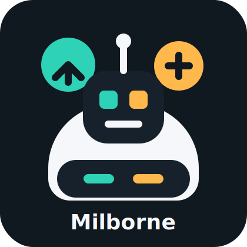

# Hola, soy Milborne



```txt
Tecnologia + IA + videojuegos
Curioso por defecto, jugador por naturaleza.
```

Me gusta explorar ideas donde la tecnologia se vuelve practica, creativa y un poco mas divertida. Disfruto aprender sobre inteligencia artificial, probar herramientas nuevas y entender como pequenas automatizaciones pueden ahorrar tiempo o abrir nuevas posibilidades.

## Lo que me mueve

- Tecnologia que resuelve problemas reales.
- Inteligencia artificial aplicada a proyectos utiles.
- Videojuegos, mundos interactivos y experiencias que invitan a experimentar.
- Aprender haciendo, romper cosas con cuidado y mejorar la siguiente version.

## En que ando

- Probando ideas con IA y automatizacion.
- Explorando herramientas para crear mejores flujos de trabajo.
- Jugando, aprendiendo y buscando formas de mezclar creatividad con codigo.

## Modo de trabajo

Me gustan los proyectos con personalidad: interfaces claras, automatizaciones utiles y soluciones que no solo funcionen, sino que tambien se sientan agradables de usar.

Si estas construyendo algo relacionado con tecnologia, IA o videojuegos, probablemente tenemos tema de conversacion.
